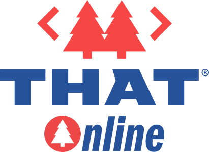

## Hey Clark, help me understand; THAT, THAT Conference, and THAT Online, what is all this?

## I don't understand.

This question came through our webchat during last Friday's THAT Online, and it's the spirit of today's newsletter. Over the past two years, a lot has changed, we've tried to adapt, innovate, and better service all Geeks, but we're not always the best at the words part of things, so let's dive in.

## What is THAT?

	

Let's start by defining what exactly **THAT** is.  The most straightforward answer, well, everything. By now, you've heard me say a community goes far beyond one's time together at THAT Conference; it exists every day. No doubt something special happens when geeks get together, it's essential, but it also shouldn't ever stop there. Our mission is to help you grow, support you, and grow the communities that surround every one of us. We also want to do all this every day of the year.

To help us achieve that mission, we started building a platform that we affectionally call THAT. You can think of it as the kernel of all things THAT, and you'll find it all at [that.us](https://that.us).

Before the pandemic, we were actively working on this notion of THAT. We aim to serve you 365 days a year while providing a better experience in person. It should be a safe place where all can collaborate.

But in saying those words, one has to define collaboration. We believe that should be up to you and, more so, the context of the support you're seeking. No one method fits everything. Maybe you want to show someone graphic designs in Photoshop, pair up on code review, or talk face to face. That context is critical to helping one another effectively and efficiently.

We set out to build a platform that would help us all. It should let us see one another, talk with one another, share, and connect us. THAT also needs to support our events, albeit both virtual or in-person. We also wanted it to be open source.

**It's also free to use.**

	<StandardLink href="/activities/">View Activities</StandardLink>

## What is THAT Conference?

	

Now without question, you found us because of THAT Conference. Looking back over the past ten years, it's crazy amazing to reflect on just how much tech has changed, and like tech, THAT Conference has grown in every aspect. THAT Conference is still and will always be at the core of our mission. Getting geeks together to support, teach, expand their networks, and grow their businesses is our passion.

You will now find THAT Conference as an event on [THAT.us](https://THAT.us), and if you browse to [THATConference.com](https://THATConference.com), it will take you to our next upcoming hybrid event.

This past year you may have noticed we've expanded our format, this "hybrid" format. With THAT.us now in place, it allowed us to give access to anyone across the globe. From here on out THAT Conference will run as a hybrid format with two main tracks, **ON THAT** and **AT THAT**. Hopefully, it's obvious but AT THAT refers to the in-person portion of THAT Conference while ON-THAT refers to the portion which is strictly online, aka on [THAT.us](https://THAT.us).

Unlike other hybrid events, ours intentionally do not intermingle. We want to respect the medium each is executing in but also lean into the different opportunities each affords to those attending. Our goal is to create the most engaging and valuable experience for all who participate.

### What is AT THAT Conference?
Everything you've come to know about THAT Conference remains the same. Simply put, you're physically AT THAT Conference. Summer Camp For Geeks.

### What is ON THAT Conference?
On the flip side of AT THAT is ON THAT. The biggest challenge with an in-person event is logistics and cost. The harsh reality is we have fixed space and time, which creates a situation where not everyone can attend or even afford to attend.

Going "online" seems like an obvious solution, but when you sit and talk with folks, we all know it's not even close to achieving its full potential. Over the past two years, there has been a lot of online this and that, and if you're in tech, you've been onlining more than you might care to admit.

We think of ON THAT different. Sure it's online, but we want your time together to be interactive. Rather than big rooms of slide-slinging and faceless attendees, we want smaller rooms with an engaging conversation centered around a topic. Think of it as an unconference with unlimited open space circles where they each have a Trail Guide. Oh yea, we're not giving up on the camping metaphors anytime soon.

Earlier I mentioned respecting the medium. The same logistics constraints don't apply when we're together online. For example, AT THAT, our main sessions need to be scheduled, they can't conflict with meals, they have limited seating, etc. On [THAT.us](https://THAT.us), there is no need to have a rigid schedule, there is no need to set durations. We should be setting topics and starting times. Again taking inspiration from Open Spaces, a conversation can last 10 minutes or 5 hours, it doesn't matter. If the folks in the room are satisfied then it was a success. Better yet, we don't need to limit the number of rooms, we can have 1 or thousands and you could pick the starting times.

### Are you moving THAT Conference to Texas?
Nope in fact it's quite the opposite. We're adding a winter event in Round Rock Texas at the new Kalahari Resort. Our Summer Camp is amazing, it's refueling, but 12 months apart is just too long. We felt we needed a Winter Retreat. So now there are two hybrid events, THAT Conference Wisconsin and THAT Conference Texas.

**THAT Conference Wisconsin** will always run the last full week of July. For 2022 we will kick off July 25th.

**THAT Conference Texas** kicks off this January (17th – 20th) marking our first THAT Conference Texas. We're slated to run yearly on the week of Dr. Martin Luther Kings Birthday. Family is still invited just like in Wisconsin and we understand there will be some challenges due to school timing. All things we're seeking feedback on and will iterate year over year.

In summary - when you think of THAT Conference you know it's one of our keystone events which is now a combination of **AT** && **ON THAT**.

	<StandardLink href="https://thatconference.com">THAT Conference</StandardLink>

## What is THAT Online?

	

That leads us to THAT Online. Much like THAT Conference's ON THAT, THAT Online is a monthly manifestation of that same spirit. A monthly unconference on the 15th of every month for 24 hours. There is no call for speakers and we all drive the schedule based on what we submit and when we schedule it.

Again there is something special when we all get together. This gives us a way to meet on a regular cadence. As time goes on we might even start to theme a few of the events. Say, for example, October's THAT Online is focused on cyber security, November's then on React.

**These are free events.** Regardless of where you call home, we are excited to see these grow and serve geeks all across the globe.

### Daily THAT - Any Day, Any Time
You do not need to wait for an event to use [THAT.us](https://THAT.us), remember 365 days. We built THAT to support you when you need it most, and it's free to use. Over the coming months, we will improve how one schedules an activity, how we engage with one another, and so on. If you'd like to learn more join us any Friday for our weekly office hours. We love feedback and we're happy to tell ya what we're thinking.

Honestly, this pandemic we've all been hiking through opened the door for us to really do what we're passionate about which is help geeks. Sure we like to write code, but we like connecting people more.

	<StandardLink href="/events/">See the upcoming events</StandardLink>

## What is THAT Membership?

If you can't tell, we've been busy, and we hope you love all that you see. Earlier this year we introduced a Membership program. We introduced this as a direct way to support us and in turn support the community at large. You can read more about it here: [https://that.us/membership/](https://that.us/membership/) and note there are some benefit improvements coming.

	<StandardLink href="/membership/">Join Today</StandardLink>

## Mark your Calendars!

### Texas
* Tickets go on sale soon.
* 10/31/2021 - 1st round of call for speakers ends for THATX.
* 11/8/21 - Initial lineup released
* 12/31/21 - Room Block Closes
* 1/17/22 - THAT TEXAS

### Wisconsin
* 11/1/2021 - Call for Sponsors Opens
* 1/1/2022 - Call for Speakers Opens