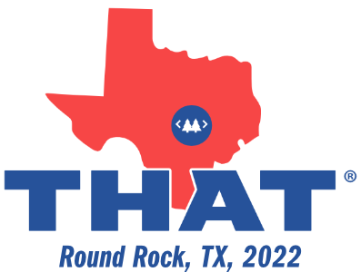
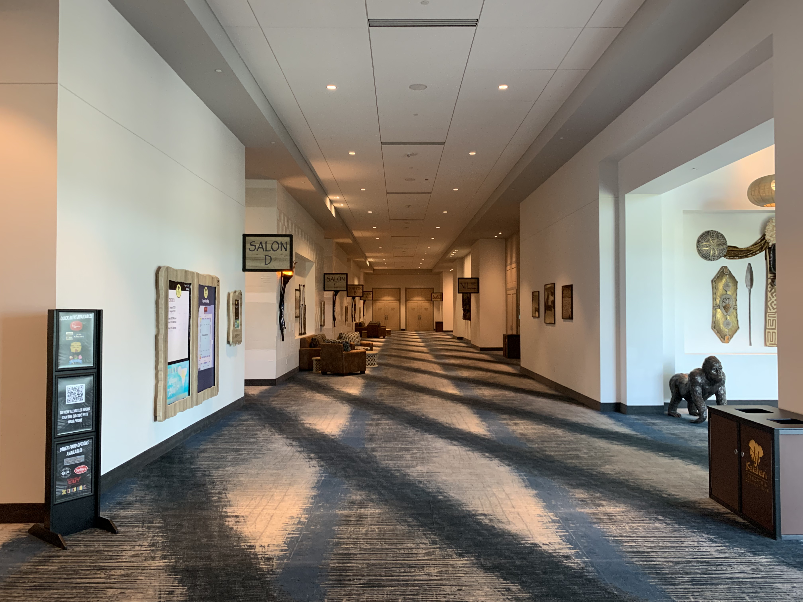

# Greetings,

In this morning edition of words that are not code:
* The road to the lone star state.
* Every month is THAT Online.
* What's up at THAT?
* Mark your calendars!

# The road to the lone star state

	

## CALL FOR SPEAKERS ENDS SOON!!!

Wait a minute, WUT you say? Yes it's true, the first round of Call For Counselors has not only snuck up fast but it "officially" closes Oct 31st. Now we did say first round but regardless don't delay. On November 8th we will start making the first set of speaker announcements.

**Let us help you with THAT abstract!** Seriously we've read thousands of abstracts. We'd love to help, and we don't even care if you want to speak at THAT, although we would love you to. Seriously we want to help you be your best you. Every Friday, you'll find us on THAT.us hosting office hours. https://that.us/activities Feel free to join us or stop by to say hi.

	<StandardLink href="/call-for-counselors/">Learn more, Submit Today</StandardLink>

## Texas Tickets and Room Blocks

We recently visited the Kalahari in Round Rock and oh my. We're putting all of the final touches on ticket pricing, room block codes, travel information, discounts, and all the goodies. Soon, very soon, we will open ticket sales. Keep an eye out, and tell your friends.

## Sponsorship Opportunities

We just couldn't run THAT without the support of our partners and sponsors. We're looking for awesome companies who are interested in partnering with us. If you're interested in hearing more, talk to us. Know a company who we should be talking with, talk to us. I guess we're saying we need your help in connecting with great companies to partner with.

## We need your help

This is our first time down in Texas and we couldn't be more excited to become part of the local community. Of course, it's all new to us and we're looking for folks to become part of our TX crew. How can you help?

* We're looking to meet all of the great communities around Texas, not just Austin. If we can help you in some way, we'd love to talk.
* Would you like to be part of the week of operations, setup, registration, teardown that kind of stuff? Great, email us, and let's chat.
* Of course call for speakers, sponsors, and soon ticket sales are all happening. We don't have some mega marketing team, it's just us connecting with people and we'd love your help in spreading the good word.

# 15th of every month === THAT Online

	

**TODAY is THAT ONLINE!** Look we know you're tired of more Zoom calls. I promise you this THAT is different. The activities on THAT are meant to be an interactive conversation, not slide-slinging. It's where we share screens and solve problems. It's where real practitioners collaborate, it's an unconference, and we hope to see you there.

Now we've already got a great lineup including an introduction to a new THAT Community and effort called Bridging The Gap. There are also lots of sessions about bugs and the web, which seems particularly appropriate for October! You can see everything that's already planned and **it's free to all**.

Remember, this isn't our THAT, it's yours. If there is something you'd like to chat about that isn't on the agenda yet, there's still time to add activities. In fact, that's the point, we all make the schedule together.

	<StandardLink href="/activities/thatus/2021-10/">View Activities</StandardLink>

# What's up at THAT?

	

Over the past two years, we've all experienced a lot of change, and THAT has been no different. The pandemic created an opportunity for us to really work towards our goals of supporting geeks every day of the year, and thus we've been crazy hard at work ever since.

It's hard to believe THAT Conference was back at the end of July. Sometimes I swear you sit down at the desk, and the next thing you know, it's bedtime, and you're not even sure what happened to the day. A lot has happened since July; let's get you caught up.

* When we left in July, Brett took off down to the Kalahari in Round Rock. We needed to scope the place out and get a better lay of the land. All we can say is while it's the same, it's also very different.
* You know I'm a fan of Svelte, and we've been holding off on upgrading to SvelteKit until WI ended. Kit paved the way for us to have a truer web experience vs. the SPA that it was before. It was a big upgrade and took a bit longer than we expected. But now you should see proper SEO, better loading times, link unfurling, and fewer bugs ;)
* We also finally launched a proper blog, and it's just the first step of making our overall communications better. Expect to see us get better and better here.
* Of course, we couldn't leave the API alone; we upgraded that to the latest and greatest and knocked off several items that were on hold until WI ended.
* On this side of this has been planning for Texas. There are many questions to answer, such as transport, contracts, vendors, and so on. As I said, it's the same, yet a very different animal. We're excited, and honestly, we also feel behind.

I'm really only scratching the surface of all the hard work, but I feel it's important to share with you as we've embarked on this journey. After all, we do it for you, and we want you to be part of it.  

~ Clark

# Mark your Calendars!

## TEXAS
* Tickets go on sale soon.
* 10/31/2021 - 1st round of call for speakers ends for THATX.
* 11/8/21 - Initial lineup released
* 12/31/21 - Room Block Closes
* 1/17/22 - THAT TEXAS

## Wisconsin
* 11/1/2021 - Call for Sponsors Opens
* 1/1/2022 - Call for Speakers Opens